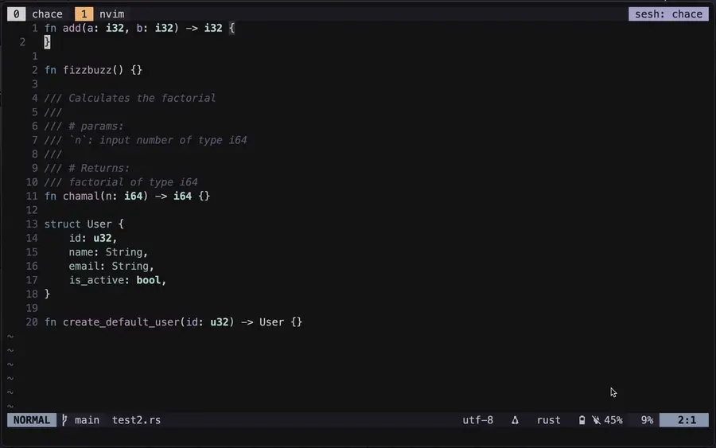

<div style="text-align: left;">
  
</div>

## Overview

**chace.nvim** integrates the CHACE Rust engine into Neovim. You can read more about CHACE by clicking [here](https://github.com/chamal1120/chace) but basically this is an AI agent configured specificically for implementing functions using function declerations.

## Demo


## Features

- Targets function declerations at cursor position
- Sends minimal context to LLM (function decleration and documentation only)
- Supports multiple LLM backends (Gemini, Groq)
- Incurs less tokens compared to tools like GitHub Copilot or agents like cursor for implementing the same function.

## Requirements

- Neovim 0.11+
- CHACE engine running (see [CHACE](https://github.com/chamal1120/chace))
- Unix socket support (Linux/macOS)

## Installation

Using [lazy.nvim](https://github.com/folke/lazy.nvim):

```lua
{
  'chamal1120/chace.nvim',
  config = function()
    require('chace').setup({
      debug = false,
      show_notifications = true,
    })
  end
}
```

Using [packer.nvim](https://github.com/wbthomason/packer.nvim):

```lua
use {
  'chamal1120/chace.nvim',
  config = function()
    require('chace').setup({
      debug = false,
      show_notifications = true,
    })
  end
}
```

## Setup

Ensure the CHACE engine is running before using the plugin:

```bash
# Start CHACE server
chace
```

Configure environment variables for LLM providers:

```bash
export GEMINI_API_KEY="your-api-key"
export GROQ_API_KEY="your-api-key"
```

## Usage

Place your cursor inside an empty function decleration and trigger completion:

```vim
:Chace
```

or use the keybind `leader + c`

## Configuration

Default configuration:

```lua
require('chace').setup({
  debug = false, -- Set to true to enable debug logs
  show_notifications = true, -- Set to false to suppress all notifications
  model = "groq", -- set model (Gemini/groq)
  keymap = "<leader>c", -- set keymap
})
```

## License

MIT License - see [LICENSE](LICENSE) for details.
